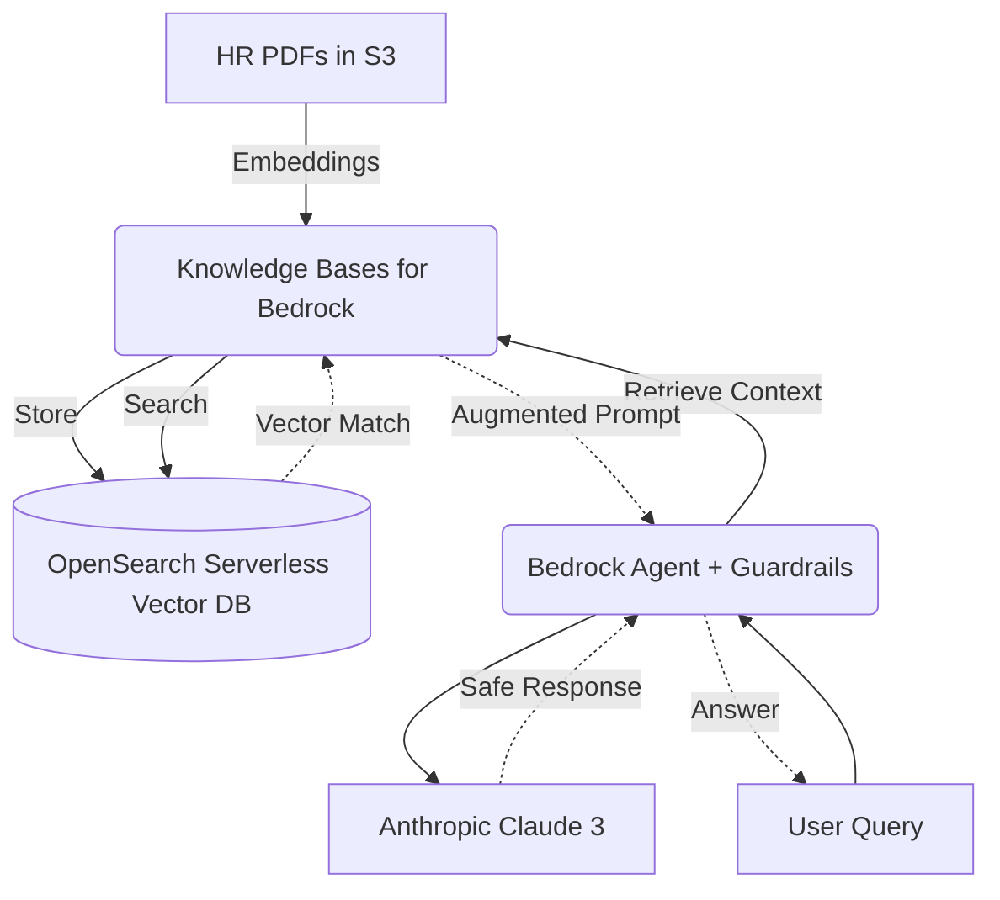

# Amazon Bedrock Deep Dive

### 1. Overview 
Amazon Bedrock is a fully managed service that offers a choice of high-performing foundation models (FMs) via a single API, along with a broad set of capabilities to build generative AI applications. On the MLA-C01 exam, Bedrock is tested prominently around **model selection**, applying **RAG (Retrieval-Augmented Generation)**, implementing **Agentic workflows**, and ensuring **responsible AI operations**. It spans multiple domains but lands heavily in Model Development (D2) and Deployment (D3).

### 2. AWS Services & Features
The exam will test you on not just what Bedrock is, but the specific sub-services utilized in an enterprise GenAI architecture:

*   **Foundation Models (FMs):** Access to models from Anthropic (Claude), Meta (Llama), Amazon (Titan), Cohere, AI21, and Mistral. **`Exam Alert`**: You must know when to use Fine-Tuning vs. RAG. If you need the model to learn *brand-new data/domain knowledge* quickly without retraining, use RAG. If you need the model to learn a specific *tone, style, or strict formatting*, use Fine-Tuning.
*   **Knowledge Bases for Amazon Bedrock:** Fully managed RAG. It seamlessly handles embedding your data from S3, pushing it into a vector database (like Amazon OpenSearch Serverless), and querying it for augmentations.
*   **Agents for Amazon Bedrock:** Allows FMs to execute multi-step tasks using enterprise systems and APIs. **`Exam Alert`**: If an exam scenario requires an LLM to take an *action* (e.g., booking a ticket, running a SQL query via an AWS Lambda function), the answer almost certainly involves Bedrock Agents.
*   **Guardrails for Amazon Bedrock:** **`Exam Alert`**: Defines customizable safety boundaries. Allows you to block PII, redact sensitive information, and apply specific policies for denied topics independently from the underlying model.
*   **Provisioned Throughput:** Guarantees performance for a specific number of model units in exchange for a time commitment. Required if you are doing custom model fine-tuning.

### 3. Practical Application
**Scenario:** Your company needs an internal HR assistant that can answer questions based on highly confidential internal PDF policies. The solution must ensure that the model doesn't hallucinate facts outside the PDFs and cannot discuss company financials.



**AWS CDK (TypeScript) Example: Least Privilege for a Bedrock Knowledge Base**
On the exam, understanding the IAM dependencies of Bedrock is critical. Bedrock must be granted permissions to call the embedding model and write to the vector datastore.

```typescript
import * as iam from 'aws-cdk-lib/aws-iam';
import { Construct } from 'constructs';

export class BedrockRAGRoleStack extends Construct {
  constructor(scope: Construct, id: string) {
    super(scope, id);

    // 1. The Execution Role assumed by Amazon Bedrock for the Knowledge Base
    const bedrockKbRole = new iam.Role(this, 'BedrockKBRole', {
      assumedBy: new iam.ServicePrincipal('bedrock.amazonaws.com'),
      description: 'IAM role for Bedrock Knowledge Base to access S3 and OpenSearch',
    });

    // 2. Least privilege to access the specific S3 Bucket containing the PDFs
    bedrockKbRole.addToPolicy(new iam.PolicyStatement({
      actions: ['s3:GetObject', 's3:ListBucket'],
      resources: [
        'arn:aws:s3:::hr-knowledge-base-bucket',
        'arn:aws:s3:::hr-knowledge-base-bucket/*'
      ],
    }));

    // 3. Permission to invoke the Amazon Titan Text Embeddings model
    bedrockKbRole.addToPolicy(new iam.PolicyStatement({
      actions: ['bedrock:InvokeModel'],
      resources: ['arn:aws:bedrock:*::foundation-model/amazon.titan-embed-text-v1'],
    }));

     // 4. Permission to write to the Vector Database (OpenSearch Serverless)
     bedrockKbRole.addToPolicy(new iam.PolicyStatement({
        actions: ['aoss:APIAccessAll'],
        resources: ['arn:aws:aoss:us-east-1:123456789012:collection/my-os-collection'],
      }));
  }
}
```

### 4. Challenges & Best Practices
*   **Security (The AWS Way):** Never allow Bedrock direct public internet access. Use **AWS PrivateLink** (VPC Endpoints) to ensure inferential traffic between your VPC and the Bedrock API stays entirely on the AWS private network structure. 
*   **Data Privacy:** AWS explicitly states in exam scenarios and service SLAs that they **do not** use your data from Amazon Bedrock to train the base foundation models.
*   **Cost Optimization:** Use **On-Demand** pricing for unpredictable workloads. Once a model is deployed to production with steady traffic, switch to **Provisioned Throughput** to guarantee latency limits and manage costs.

### 5. Additional Resources
*   [Amazon Bedrock Security and Privacy](https://aws.amazon.com/bedrock/security/)
*   [Knowledge Bases for Amazon Bedrock Documentation](https://docs.aws.amazon.com/bedrock/latest/userguide/knowledge-base.html)

---

### 6. Exam Checkpoint

Let's test this knowledge. Read the following two scenarios and tell me your answers. I'll evaluate them and break down why the distractors are incorrect.

**Question 1 (Domain 2 - Architecture / Edge Case)**
An enterprise wants to deploy an internal chat application using a Llama foundation model on Amazon Bedrock. The application will be used by the customer support team. The legal department mandates that the chat application must completely reject any user queries asking for legal or financial advice. Furthermore, this logic must be decoupled from the core application codebase.
What is the most administratively efficient way to satisfy these requirements?
A) Fine-tune the Llama model on examples of legal and financial queries mapped to rejection responses.
B) Use an AWS Lambda function triggered by API Gateway to run regex parsing on all inputs before they reach Bedrock.
C) Implement Guardrails for Amazon Bedrock and define a Denied Topic policy for legal and financial advice.
D) Use Agents for Amazon Bedrock to route legal and financial queries to a null endpoint.

**Question 2 (Domain 2 - RAG vs Fine-Tuning)**
A Machine Learning Engineer needs to build an application using Amazon Bedrock that can summarize and answer questions about a constantly updating database of internal company engineering wikis. The tone of the underlying model is acceptable, but it currently hallucinates because it lacks the specific engineering vocabulary and factual knowledge contained in the wikis.
Which approach requires the LEAST amount of operational overhead?
A) Continually Pre-train an Amazon Titan model using the daily wiki exports.
B) Implement Knowledge Bases for Amazon Bedrock, pointing it to an S3 bucket synchronized with the wiki, and an OpenSearch Serverless collection.
C) Use SageMaker JumpStart to deploy a HuggingFace QA model and fine-tune it daily.
D) Purchase Provisioned Throughput on Amazon Bedrock and submit hourly fine-tuning jobs using the `bedrock:CreateCustomModel` API.
