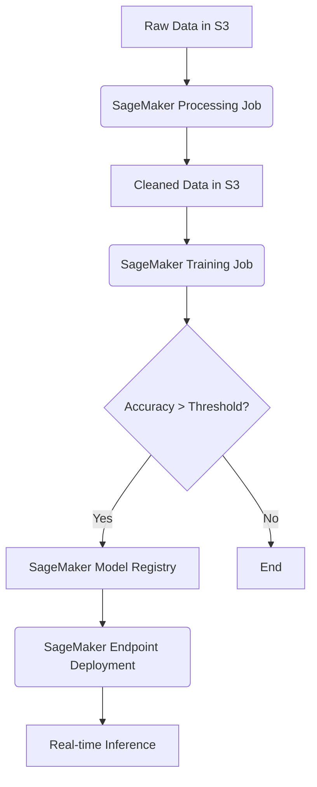

# SageMaker Deep Dive

### 1. Overview 
Amazon SageMaker is a fully managed service encompassing data preparation, algorithm development, model training, and deployment. On the MLA-C01 exam, SageMaker is tested heavily across every single domain. You won't just be asked *what* SageMaker is; you will be tested on *which specific SageMaker feature* or *configuration parameter* optimally solves a given engineering, cost, or latency constraint.

### 2. AWS Services & Features
Because SageMaker is a massive umbrella, let's categorize its features by how the exam tests them:

*   **Data Preparation (D1):**
    *   **SageMaker Data Wrangler:** Visual data preparation.
    *   **SageMaker Processing:** Ephemeral clusters for running data transformations (e.g., PySpark, Scikit-learn).
    *   **SageMaker Feature Store:** **`Exam Alert`** Understand the difference between the **offline store** (backed by S3 + Athena, used for training) and the **online store** (backed by DynamoDB, used for low-latency inference).
*   **Model Training & Tuning (D2):**
    *   **Built-in Algorithms:** (XGBoost, BlazingText, DeepAR, etc.) You must know their primary use cases. 
    *   **File Mode vs. Pipe Mode:** **`Exam Alert`** Use **Pipe Mode** for large datasets to stream data directly from S3 to the container, bypassing the need to download the full dataset to EBS volumes first.
    *   **Automatic Model Tuning (HPO):** Uses Bayesian Search to find optimal hyperparameters efficiently.
*   **Deployment & Inference (D3):**
    *   **Real-time Endpoints:** Always-on, sub-millisecond latency. High cost.
    *   **Async Inference:** **`Exam Alert`** Best for payloads up to 1GB or processing times up to 15 minutes. It queues requests via SNS/SQS.
    *   **Serverless Inference:** Best for intermittent, bursty, or completely unpredictable traffic where cold starts are acceptable.
    *   **Batch Transform:** Offline inference on bulk datasets in S3. Spins down when done.
*   **Monitoring & Optimization (D4):**
    *   **SageMaker Model Monitor:** Continuously monitors data drift, model quality, and feature attribution drift in production.
    *   **SageMaker Clarify:** **`Exam Alert`** The definitive tool for **bias detection** (pre-training and post-training) and **explainability** (using SHAP values). 

### 3. Practical Application
**Scenario:** You are automating a fraud detection pipeline. The data must be preprocessed, a model trained using XGBoost, and if the accuracy exceeds a threshold, it should be registered in the Model Registry and deployed for real-time inference. 



**AWS CDK (TypeScript) Example: Deploying a SageMaker Endpoint**
On the exam, you need to understand that an endpoint requires a Model, an Endpoint Configuration, and the Endpoint itself. 

```typescript
import * as sagemaker from 'aws-cdk-lib/aws-sagemaker';
import * as iam from 'aws-cdk-lib/aws-iam';
import { Construct } from 'constructs';

export class SageMakerInferenceStack extends Construct {
  constructor(scope: Construct, id: string) {
    super(scope, id);

    // 1. The Execution Role used by SageMaker
    const sagemakerRole = new iam.Role(this, 'SageMakerExecutionRole', {
      assumedBy: new iam.ServicePrincipal('sagemaker.amazonaws.com'),
      managedPolicies: [iam.ManagedPolicy.fromAwsManagedPolicyName('AmazonSageMakerFullAccess')],
    });

    // 2. The Model Definition
    const model = new sagemaker.CfnModel(this, 'FraudModel', {
      executionRoleArn: sagemakerRole.roleArn,
      primaryContainer: {
        image: '123456789012.dkr.ecr.us-east-1.amazonaws.com/xgboost:latest',
        modelDataUrl: 's3://my-ml-bucket/models/fraud/model.tar.gz',
      },
    });

    // 3. The Endpoint Configuration (Defines Instance Type and count)
    const endpointConfig = new sagemaker.CfnEndpointConfig(this, 'EndpointConfig', {
      productionVariants: [{
        modelName: model.attrModelName,
        initialInstanceCount: 1,
        instanceType: 'ml.m5.xlarge',
        variantName: 'AllTraffic',
      }],
    });
    endpointConfig.addDependency(model);

    // 4. The actual Endpoint deployment
    const endpoint = new sagemaker.CfnEndpoint(this, 'FraudEndpoint', {
      endpointConfigName: endpointConfig.attrEndpointConfigName,
    });
    endpoint.addDependency(endpointConfig);
  }
}
```

### 4. Challenges & Best Practices
*   **Security (The AWS Way):** Never use `AmazonSageMakerFullAccess` in production (despite the quick example above!). Follow **Least Privilege** by restricting S3 bucket access down to specific prefixes. Secure SageMaker Notebooks and Studio to a VPC, disabling direct internet access, and leveraging **VPC Endpoints (PrivateLink)** to interface with S3 and ECR.
*   **Cost Optimization:** **`Exam Alert`** For non-time-sensitive model training, use **Managed Spot Training** with checkpointing enabled to save up to 90% on EC2 costs. Downscale or use Multi-Model Endpoints if you have many models with low usage instead of dedicating instances to each.

### 5. Additional Resources
*   [Amazon SageMaker Architecture Best Practices (AWS Whitepaper)](https://docs.aws.amazon.com/wellarchitected/latest/machine-learning-lens/machine-learning-lens.html)
*   [Amazon SageMaker Deep Dive - AWS Skill Builder](https://explore.skillbuilder.aws/)

---

### 6. Exam Checkpoint

Let's test this knowledge. Read the following two scenarios and tell me your answers. I'll evaluate them and break down why the distractors are incorrect.

**Question 1 (Domain 2 - Tricky)**
An ML tracking system has accumulated 500 GB of numerical training data stored in an S3 bucket. A Machine Learning Engineer needs to train an XGBoost model using the SageMaker built-in algorithm. The engineer wants to ensure the training job starts as quickly as possible and minimizes the EBS storage capacity required for the ML compute instances.
Which approach should the engineer use?
A) Use File mode and attach a large EBS volume to the training instance.
B) Use Fast File mode (FFM) to copy data to EBS quickly.
C) Use Pipe mode to stream the data directly from S3 to the training container.
D) Compress the data into a ZIP file in S3 and use File mode.

**Question 2 (Domain 3 - Associate)**
Your team has trained an ML model that processes high-resolution satellite imagery. Each image payload is approximately 50 MB, and the inference takes around 2 minutes per image. Traffic is sporadic but can occasionally spike. You need to deploy this model as cost-effectively as possible while ensuring no requests are dropped during traffic spikes. 
Which deployment option is most appropriate?
A) SageMaker Real-time Endpoint with an Application Load Balancer
B) SageMaker Asynchronous Inference Endpoint
C) SageMaker Serverless Inference Endpoint
D) SageMaker Batch Transform Job triggered by CloudWatch
